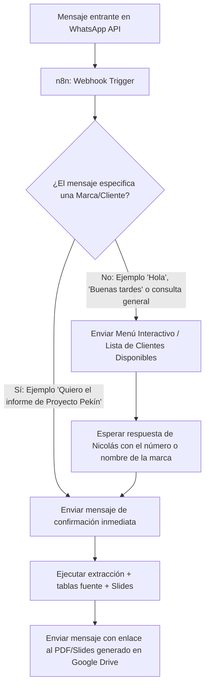

# Documento de Especificación Técnica: Generador de Informes Ejecutivos vía WhatsApp + n8n

**Cliente / Proyecto:** Tic Tac Agency (Nicolás)  
**Desarrollador / Líder Técnico:** Santi  
**Tecnología Base:** n8n (desplegado en Render), WhatsApp/YCloud, Google Ads API, Meta Ads API, Google Cloud (Slides/Drive/Sheets) y HubSpot
**Versión:** 1.0 (Fase 1: Prueba de Concepto Monocliente escalable a Multi-cliente)

> Estado operativo al 13 de agosto de 2026: Google Ads, Meta Ads y las metas de
> Google Sheets están activos con datos reales bajo `MONTH_TO_DATE` para Pekín,
> Skala y Métriku. El generador de tablas y etiquetas para IA externa está
> publicado y validado en la ejecución `2746`. HubSpot se inserta manualmente en la diapositiva 17. Consultar
> `CODEX_HANDOFF.md` para el estado autoritativo. La implementación productiva
> está publicada en el commit `7225e7f`; la actualización documental de esta
> fase queda local hasta que el usuario autorice otro commit.

---

## 1. Visión y Objetivo del Proyecto

El objetivo es construir un **Flujo de Automatización Bajo Demanda en n8n** que permita a Nicolás (Director de Tic Tac Agency) solicitar y generar informes ejecutivos cada siete días para los clientes de su agencia directamente desde **WhatsApp**. Cada informe representa el acumulado del mes: comienza el día 1 y termina en el instante de generación.

El sistema consulta datos reales de **Google Ads** y **Meta Ads**, construye
`reportDataV1` y clona y rellena una plantilla de **Google Slides** con tablas
fuente. Google Sheets es la fuente autoritativa de metas y presupuestos
mensuales. Una IA externa generará posteriormente los dashboards y análisis a
partir del Slides editable; HubSpot y creativos se completan manualmente.

---

## 2. Flujo Conversacional en WhatsApp (Lógica de Enrutamiento)

Como Nicolás no requiere todos los informes el mismo día, la generación se dispara **a solicitud (on-demand)** a través de WhatsApp Webhooks.

### Casos de Uso del Bot de WhatsApp:

#### Caso A: Solicitud Directa de Informe (Marca identificada)
* **Nicolás:** *"Hola, genera el informe de Proyecto Pekín porfa."*
* **Respuesta Automática n8n:**  
  > *"¡Recibido, Nicolás! 🚀 Estoy procesando las campañas para **Proyecto Pekín**. En un par de minutos te enviaré el enlace a las diapositivas listas en tu Drive."*
* **Acción n8n:** Ejecuta la consulta de datos, completa las tablas y etiquetas de Google Slides y devuelve:
  > *"✅ **Informe de Proyecto Pekín completado.**  
  > 📁 **Enlace al informe en Drive:** [Ver Presentación en Google Drive](https://drive.google.com/...)  
  > 📊 **Resumen:** 103 leads generados (54.2% cumplimiento de meta)."*

#### Caso B: Saludo o Consulta General (Sin marca especificada)
* **Nicolás:** *"Hola"* o *"¿De qué marcas puedo sacar informe?"*
* **Respuesta Automática n8n:**  
  > *"¡Hola Nicolás! 👋 ¿Para qué cliente deseas generar el informe ejecutivo hoy?  
  > 
  > 1️⃣ **Proyecto Pekín** (Activo)  
  > 2️⃣ **Proyecto Skala** (datos integrados en el informe de Pekín; informe independiente pendiente)
  > 3️⃣ **Cliente Prueba**  
  > 
  > Responde con el nombre o el número de la marca para iniciar la generación."*

---

## 3. Arquitectura del Flujo en n8n (Nodo por Nodo)

### Nodo 1: WhatsApp Webhook Trigger
* **Función:** Recibe las notificaciones de mensajes entrantes de la API Oficial de WhatsApp Cloud / Meta Business.

### Nodo 2: Extract & Clean Payload (Code Node / Set Node)
* **Función:** Extrae el número de teléfono del remitente (`from`), el nombre del remitente y el texto del mensaje (`message_text`).

### Nodo 3: Intent Classifier / Router (Switch / Code Node + reglas)
* **Función:** Evalúa el texto del mensaje contra la lista de marcas activas en la Tabla Maestra.
  * Si encuentra la marca (ej: `Pekín` o `1`), asigna la variable `client_id = "CLI-001"` y toma la rama A.
  * Si no encuentra marca (ej: `Hola`), toma la rama B para desplegar el menú.

### Nodo 4 (Rama B): Send WhatsApp Menu (HTTP Request Node)
* **Función:** Envía el menú interactivo o mensaje con la lista de clientes disponibles a Nicolás y finaliza la ejecución hasta la respuesta.

### Nodo 5 (Rama A): Send Instant Confirmation (HTTP Request Node)
* **Función:** Responde inmediatamente a Nicolás confirmando que la generación ha comenzado.

### Nodo 6: Read Client Configuration (Google Sheets Node)
* **Estado:** activo en producción para Proyecto Pekín, Skala y Métriku.
* **Función:** Selecciona la pestaña del mes vigente y lee KPI, costo por
  resultado e inversión mensual de las campañas publicadas en el informe.
* **Regla:** Las metas son mensuales completas. Si Vivienda no tiene meta en el
  mes, conserva su rendimiento real y muestra `Meta no definida`, sin calcular
  cumplimiento.

### Nodo 7: Data Collector (HubSpot API Node / HTTP Request)
* **Estado:** diferido hasta disponer de una Private App de solo lectura.
* **Función futura:** Consultar la API de HubSpot entre `periodStart` y
  `periodEnd`. Mientras tanto, la diapositiva 17 queda libre para pegar
  manualmente los dashboards aprobados.

### Nodo 8: Preparar Datos del Informe
* **Función:** Construye `reportDataV1` con periodo, procedencia, resúmenes por campaña y series diarias, demográficas y de plataforma. No crea gráficos.

### Nodo 9: Google Slides Engine (Google Slides API Node / HTTP Request)
* **Función:** 
  1. Duplica la plantilla estándar de diapositivas de Tic Tac Agency.
  2. Ejecuta un `batchUpdate` para reemplazar placeholders escalares, crear tablas fuente con IDs estables y escribir etiquetas de dashboard/análisis para una IA posterior.
  3. Mueve la presentación duplicada a la carpeta de Drive del cliente.

### Nodo 10: Final Notification (HTTP Request Node)
* **Función:** Envía a Nicolás por WhatsApp el mensaje final con el enlace directo al informe recién generado.

---

## 4. Estructura de Datos y Mapeo de la Plantilla de Diapositivas

Basado en la presentación real de 29 diapositivas de Tic Tac Agency (Proyecto Pekín/Skala):

| Sección de la Diapositiva | Origen de los Datos | Placeholder en Google Slides |
| :--- | :--- | :--- |
| **Portada (Slide 1-2)** | Configuración del Cliente | `{{NOMBRE_PROYECTO}}` |
| **Tabla de Rendimiento (Slide 3)** | Google Sheets Metas + Ads API | `{{KPI_META}}`, `{{KPI_REAL}}`, `{{PERFORMANCE_PCT}}`, `{{INVERSION_REAL}}` |
| **Performance por Línea (Slide 4)** | Datos calculados por n8n | `{{VIVIENDA_INVERSION}}`, `{{VIVIENDA_LEADS}}`, `{{VIVIENDA_CPA}}` |
| **Análisis Cualitativo** | IA externa posterior | Etiquetas visibles con fuente, campaña, criterios y periodo; sin IA dentro de n8n |
| **Datos para dashboards Ads** | Meta Ads + Google Ads + Google Sheets | Tablas visibles de resumen, tendencia, demografía y plataforma |
| **Dashboards HubSpot (Slide 17)** | Inserción manual vigente | Sin placeholders automáticos; área libre para dos dashboards |

---

## 5. Estrategia de Implementación y Despliegue

### Fase 1: Prueba de Concepto (Monocliente - Gratuito)
* **Cliente de Prueba:** 1 Proyecto Real de Tic Tac Agency (ej: Proyecto Pekín).
* **Entorno n8n:** Servidor en **Render (Free Tier)**.
* **Modo de Operación:** Ejecución bajo demanda iniciada desde WhatsApp por Nicolás.
* **Costo Operativo:** **$0.00 USD/mes**.

### Fase 2: Escalado Multi-Cliente
* **Expansión:** Adición de nuevas filas en la hoja de Google Sheets por cada cliente nuevo de Tic Tac Agency.
* **Infraestructura:** Migración opcional al plan Starter de Render ($7 USD/mes) cuando aumente la carga de solicitudes.

---

## 6. Análisis y dashboards posteriores

Gemini no forma parte del workflow. Cada página analítica muestra etiquetas
`DASHBOARD A GENERAR` y `ANÁLISIS A GENERAR` con fuente, campaña, tipo,
criterios y periodo. Una IA externa trabajará después sobre el Slides editable.
El análisis debe contrastar el acumulado desde el día 1, la meta mensual completa, el
CPA y la calidad del resultado antes de redactar el comentario definitivo.

Antigravity ejecutará esta fase sobre una copia del informe aceptado. Su fuente
de verdad son las tablas y etiquetas visibles del Slides; no debe consultar
otras APIs, cambiar el periodo, completar HubSpot/creativos con supuestos ni
alterar la presentación fuente. La entrega debe incluir el enlace de la copia,
el mapeo tabla→dashboard y una validación visual de las 29 diapositivas.

Documentos de ejecución:

- `ANTIGRAVITY_HANDOFF.md`: contexto, alcance, mapa de diapositivas y criterios
  de aceptación;
- `PROMPT_ANTIGRAVITY_DASHBOARDS.md`: prompt listo para iniciar el trabajo.

---

## 7. Firma de Aprobación del Proyecto

* **Elaborado por:** Santi
* **Aprobado para Desarrollo en:** n8n / Codex
* **Estado:** Generador productivo aceptado; fase de dashboards y análisis con Antigravity pendiente
