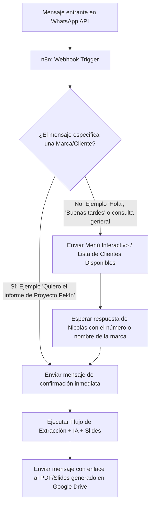

# Documento de Especificación Técnica: Generador de Informes Ejecutivos vía WhatsApp + n8n

**Cliente / Proyecto:** Tic Tac Agency (Nicolás)  
**Desarrollador / Líder Técnico:** Santi  
**Tecnología Base:** n8n (Desplegado en Render), WhatsApp Business API, HubSpot API, Google Cloud (Slides/Drive/Sheets), Gemini 1.5/2.5 Flash API  
**Versión:** 1.0 (Fase 1: Prueba de Concepto Monocliente escalable a Multi-cliente)

---

## 1. Visión y Objetivo del Proyecto

El objetivo es construir un **Flujo de Automatización Bajo Demanda en n8n** que permita a Nicolás (Director de Tic Tac Agency) solicitar y generar informes ejecutivos cada siete días para los clientes de su agencia directamente desde **WhatsApp**. Cada informe representa el acumulado del mes: comienza el día 1 y termina en el instante de generación.

El sistema consulta los datos cuantitativos de **HubSpot** y la hoja de metas de la agencia, utiliza un Modelo de Lenguaje (**Gemini/OpenAI API**) para redactar la síntesis cualitativa con el tono estratégico de Tic Tac Agency, y clona y rellena automáticamente una plantilla estándar en **Google Slides** de 29 diapositivas, entregando el archivo final en Google Drive con una notificación por WhatsApp.

---

## 2. Flujo Conversacional en WhatsApp (Lógica de Enrutamiento)

Como Nicolás no requiere todos los informes el mismo día, la generación se dispara **a solicitud (on-demand)** a través de WhatsApp Webhooks.



### Casos de Uso del Bot de WhatsApp:

#### Caso A: Solicitud Directa de Informe (Marca identificada)
* **Nicolás:** *"Hola, genera el informe de Proyecto Pekín porfa."*
* **Respuesta Automática n8n:**  
  > *"¡Recibido, Nicolás! 🚀 Estoy procesando la información de HubSpot y campañas para **Proyecto Pekín**. En un par de minutos te enviaré el enlace a las diapositivas listas en tu Drive."*
* **Acción n8n:** Ejecuta la consulta de datos, el análisis por IA, la inyección en Google Slides y devuelve:  
  > *"✅ **Informe de Proyecto Pekín completado.**  
  > 📁 **Enlace al informe en Drive:** [Ver Presentación en Google Drive](https://drive.google.com/...)  
  > 📊 **Resumen:** 103 leads generados (54.2% cumplimiento de meta)."*

#### Caso B: Saludo o Consulta General (Sin marca especificada)
* **Nicolás:** *"Hola"* o *"¿De qué marcas puedo sacar informe?"*
* **Respuesta Automática n8n:**  
  > *"¡Hola Nicolás! 👋 ¿Para qué cliente deseas generar el informe ejecutivo hoy?  
  > 
  > 1️⃣ **Proyecto Pekín** (Activo)  
  > 2️⃣ **Proyecto Skala** (Próximamente)  
  > 3️⃣ **Cliente Prueba**  
  > 
  > Responde con el nombre o el número de la marca para iniciar la generación."*

---

## 3. Arquitectura del Flujo en n8n (Nodo por Nodo)

### Nodo 1: WhatsApp Webhook Trigger
* **Función:** Recibe las notificaciones de mensajes entrantes de la API Oficial de WhatsApp Cloud / Meta Business.

### Nodo 2: Extract & Clean Payload (Code Node / Set Node)
* **Función:** Extrae el número de teléfono del remitente (`from`), el nombre del remitente y el texto del mensaje (`message_text`).

### Nodo 3: Intent Classifier / Router (Switch / Code Node + IA)
* **Función:** Evalúa el texto del mensaje contra la lista de marcas activas en la Tabla Maestra.
  * Si encuentra la marca (ej: `Pekín` o `1`), asigna la variable `client_id = "CLI-001"` y toma la rama A.
  * Si no encuentra marca (ej: `Hola`), toma la rama B para desplegar el menú.

### Nodo 4 (Rama B): Send WhatsApp Menu (HTTP Request Node)
* **Función:** Envía el menú interactivo o mensaje con la lista de clientes disponibles a Nicolás y finaliza la ejecución hasta la respuesta.

### Nodo 5 (Rama A): Send Instant Confirmation (HTTP Request Node)
* **Función:** Responde inmediatamente a Nicolás confirmando que la generación ha comenzado.

### Nodo 6: Read Client Configuration (Google Sheets Node)
* **Función:** Lee la fila del cliente en la Tabla Maestra de Google Sheets. Obtiene:
  * ID de Empresa en HubSpot.
  * ID de la Plantilla de Google Slides de Tic Tac Agency.
  * ID de la Carpeta de Google Drive del Cliente.
  * Metas mensuales o metas del periodo acumulado de leads e inversión.

### Nodo 7: Data Collector (HubSpot API Node / HTTP Request)
* **Función:** Consulta la API de HubSpot entre `periodStart` y `periodEnd`, es decir, desde el primer día del mes hasta el instante de generación:
  * Conteo de contactos/leads por etapa del pipeline (Registrados, MQLs, No Nicho, Pendientes de Clasificación, Ventas).

### Nodo 8: AI Strategic Copywriting (Gemini / OpenAI API Node)
* **Función:** Recibe los datos consolidados y genera mediante un System Prompt especializado los textos ejecutivos para los bullet points de las diapositivas (estilo Tic Tac Agency).

### Nodo 9: Google Slides Engine (Google Slides API Node / HTTP Request)
* **Función:** 
  1. Duplica la plantilla estándar de diapositivas de Tic Tac Agency.
  2. Ejecuta un `batchUpdate` para reemplazar todos los placeholders dinámicos (`{{META_LEADS}}`, `{{CUMPLIMIENTO}}`, `{{ANALISIS_VIVIENDA}}`, `{{EMBUDO_MQLS}}`, etc.).
  3. Mueve la presentación duplicada a la carpeta de Drive del cliente.

### Nodo 10: Final Notification (HTTP Request Node)
* **Función:** Envía a Nicolás por WhatsApp el mensaje final con el enlace directo al informe recién generado.

---

## 4. Estructura de Datos y Mapeo de la Plantilla de Diapositivas

Basado en la presentación real de 29 diapositivas de Tic Tac Agency (Proyecto Pekín/Skala):

| Sección de la Diapositiva | Origen de los Datos | Placeholder en Google Slides |
| :--- | :--- | :--- |
| **Portada (Slide 1-2)** | Configuración del Cliente | `{{NOMBRE_PROYECTO}}` |
| **Tabla de Rendimiento (Slide 3)** | Google Sheets Metas + Ads API | `{{KPI_META}}`, `{{KPI_REAL}}`, `{{PERFORMANCE_PCT}}`, `{{INVERSION_REAL}}` |
| **Performance por Línea (Slide 4)** | Datos calculados por n8n | `{{VIVIENDA_INVERSION}}`, `{{VIVIENDA_LEADS}}`, `{{VIVIENDA_CPA}}` |
| **Análisis Cualitativo (Slides 5, 6, 7)** | **Gemini / ChatGPT API** | `{{ANALISIS_TENDENCIA_VIVIENDA}}`, `{{RECOMENDACION_AGENCIA_VIVIENDA}}` |
| **Embudo CRM (Slide 17)** | **HubSpot API** | `{{LEADS_REGISTRADOS}}`, `{{MQLS}}`, `{{NO_NICHO}}`, `{{PENDIENTES}}`, `{{SINTESIS_EMBUDO}}` |

---

## 5. Estrategia de Implementación y Despliegue

### Fase 1: Prueba de Concepto (Monocliente - Gratuito)
* **Cliente de Prueba:** 1 Proyecto Real de Tic Tac Agency (ej: Proyecto Pekín).
* **Entorno n8n:** Servidor en **Render (Free Tier)**.
* **Modo de Operación:** Ejecución bajo demanda iniciada desde WhatsApp por Nicolás.
* **Costo Operativo:** **$0.00 USD/mes**.

### Fase 2: Escalado Multi-Cliente
* **Expansión:** Adición de nuevas filas en la hoja de Google Sheets por cada cliente nuevo de Tic Tac Agency.
* **Infraestructura:** Migración opcional al plan Starter de Render ($7 USD/mes) cuando aumente la carga de solicitudes.

---

## 6. Prompt del Sistema Recomendado para el Nodo de IA

```text
Eres un Director de Estrategia de Marketing Digital de la agencia "Tic Tac Agency".
Tu tarea es analizar las métricas cuantitativas acumuladas del mes de las campañas y CRM del cliente, desde el día 1 hasta el instante de generación, y redactar observaciones ejecutivas breves, formales y proactivas para ser insertadas en una presentación de Google Slides. La revisión puede ocurrir cada siete días, pero nunca debes describir el periodo como una semana aislada ni como los últimos siete días.

Formatos requeridos de tono:
- Utiliza frases estratégicas como: "Durante los primeros días del período observamos...", "Desde la agencia, consideramos que...", "El siguiente paso será...".
- Mantén un enfoque orientado a la rentabilidad, eficiencia de costo por lead (CPL/CPA) y optimización de canales (Instagram/Facebook).
- Devuelve la respuesta en formato JSON estricto con las llaves correspondientes a los placeholders del reporte.
```

---

## 7. Firma de Aprobación del Proyecto

* **Elaborado por:** Santi
* **Aprobado para Desarrollo en:** n8n / Codex
* **Estado:** Listo para construcción de Nodos
